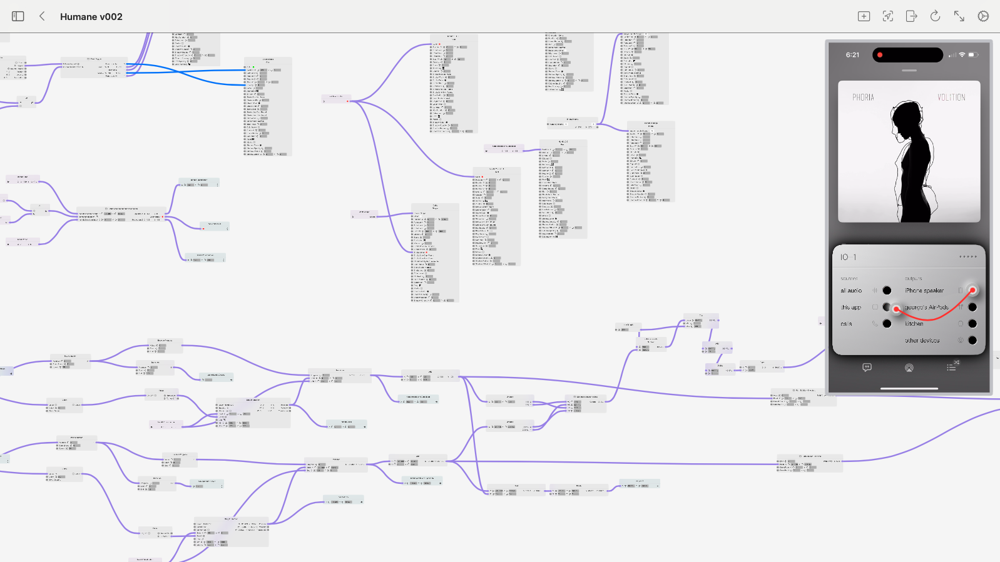
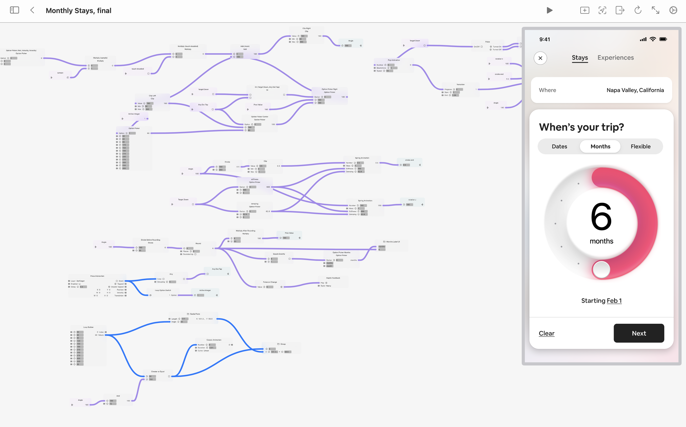
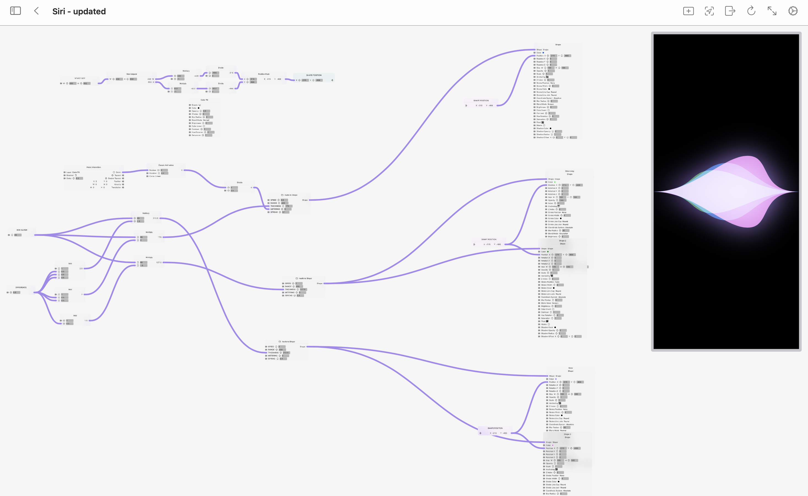
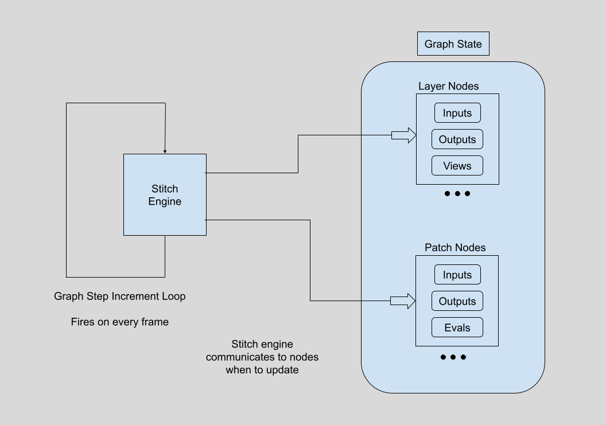
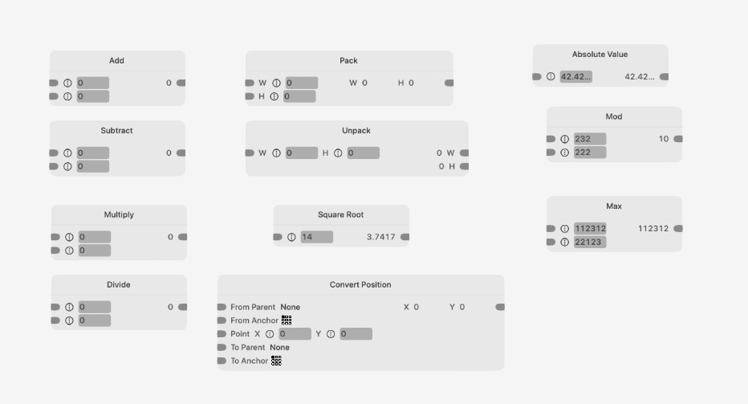
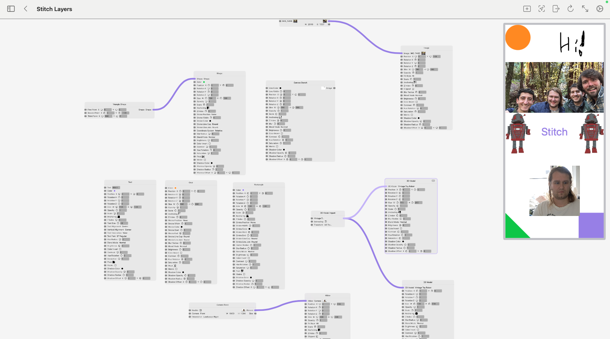

# Stitch (Beta)


We’re an Apple first, open source, and community driven prototyping environment. iPad, iPhone, macOS with Vision Pro coming soon. We're in beta and have so much more we want to give.

## What is Stitch
Stitch follows in the footsteps of giants, namely [QC](https://en.wikipedia.org/wiki/Quartz_Composer) and [Origami](http://origami.design).

We created Stitch to solve three main problems:

1. Make it Open Source. Freely avalible to everyone to modify and extend.
2. Modern Apple Frameworks. Base it on the latest from Apple. iCloud Syncing, SwiftUI, and support on every device they create.
3. Community Driven. Build it in the open with the community driving.

The history of visual programming languages a wonderful one, but it has its woes. The two biggest examples [QC](https://en.wikipedia.org/wiki/Quartz_Composer) and [Origami](http://origami.design), are both examples of side projects for bigger companies and neither is open source. When QC became defunct, Facebook worked on creating Origami to fill the gap left by it. If QC was open source, Facebook wouldn’t have had to start from scratch. Not to discredit the incredible team at Facebook, but we’ve noticed Origami isn’t really their main focus. It’ll also never support things like ARKit and the Vision Pro for obvious reasons. There are so many wonderful people out there who relay on these tools for their work, and have incredible ideas on how to improve them, we think the world would be a better place with an open source, completely community driven visual programming language.

We’re excited to give others a tool to use and one they can improve themselves. It’s going to be insane to see what the community creates.

We’ve also built Stitch on top of Apple’s modern frameworks, so it’d a first class citizen across your devices. Including on your Mac, iPhone, and on your iPad, and once we have the time (or if a community member can help us 😉) the Vision Pro. We joke that maybe someday we can find a reason to support the Apple Watch, too.

It syncs all your documents via iCloud, so they’re all in one place and work across all your devices. Also they’re all private to you and only you.

You and use and import USDZ (Apple’s primary 3D model format) and use them with ARKit primitives.

You can import your CoreML models (or use one’s we supply) to use powerful AI in your prototypes.

We’re active on GitHub and on [Campsite](https://app.campsite.co/stitch/posts). Join us, help us improve with ideas and code. 

We genuinely believe the world is a more interesting and wonderful place with easy ways to prototype your ideas, and have dedicated very nontrivial amounts of time and effort to help this cause.


## Stitch Principles

1. Stitch is a graph-based visual programming language for UX prototyping. A node on the graph is either a ‘patch’ (function) or a ‘layer’ (UI element in the prototype window).
2. Stitch is an interface to SwiftUI. Wherever possible, we expose SwiftUI views, view modifiers and methods.
3. Stitch runs on a clock. On every new frame, the entire graph may be recalculated, allowing for smooth animations and dynamic prototypes.


### 1. Stitch is a graph-based visual programming language for UX prototyping

Build User Interfaces with layers and complex interaction behavior with patches.








### 2. Stitch is an interface to SwiftUI

Stitch itself is built primarily in SwiftUI. It’s also meant to match what can be built in SwiftUI. The prototypes you build in Stitch closely mirror what can be built in SwiftUI, so the handoff from designer to developer will be as smooth as possible.

For example, the Spring Animation Node uses the native SwiftUI `Spring`, which powers SwiftUI animations.

```func springAnimationNumberOp(values: PortValues, // ie inputs and outputs
// Use SwiftUI native Spring to model damping, stiffness etc.
let spring = Spring(mass: mass,
		stiffness: stiffness,
		damping: damping)
```


Similarly, the Text Layer Node is just an interface to the native SwiftUI Text :

```
struct LayerTextView: View {
    let value: String
    let color: Color
    let fontSize: LayerDimension
    let textAlignment: LayerTextAlignment
    let verticalAlignment: LayerTextVerticalAlignment
    let textDecoration: LayerTextDecoration
    let textFont: StitchFont

    var body: some View {
        Text(value)
            .font(.system(size: fontSize.asNumber,
                          weight: textFont.fontWeight.asFontWeight,
                          design: textFont.fontWeight.asFontWeight))
            .foregroundColor(color)
            .underline(textDecoration.isUnderline, pattern: .solid)
            .strikethrough(textDecoration.isStrikethrough, pattern: .solid)
    }
}
```


### 3. Stitch runs on a clock

Stitch works by evaluating the connections between the nodes on a graph every clock-step.

The core of each node is its "eval" function. On each graph step, a node's eval may be called. Evaluating a node may produce new outputs, which are then sent to downstream nodes' inputs.





`StitchEngine` contains logic for scheduling node evaluations. As a contributor, you only need to write a node's eval function, and we take care of the rest. ;-)

When an input on a layer node is updated, the contents of the prototype window are re-rendered.

#### Will StitchEngine be open sourced?

We’re definitely open to the idea. Our thoughts right now are they it’s a small library that’s likely to not change very much. We were able to clean up our code and ship it faster by keeping this in a separate package. Our hope is that no one will ever really need or want to change it, but if that’s not true, please [shoot as an email](mailto:us@stitchdesign.com) — we’d love to hear from you. Our ideas here are likely to evolve and grow over time.


## Nodes

Nodes are the building blocks of Stitch. When you build a prototype, you do so by adding nodes to the graph and connecting them together.

### Patch Nodes

Patch nodes are functions. Their input ports are inputs to a function, their output ports are the return values of that function. Each patch (function) can be connected to any other patch (function).



### Layer Nodes

Layer nodes create the views that make up your prototype. Anything that’s a layer gets shown in the preview window. We use SwiftUI to generate these views.




## Who we are

We’re a group of passionate engineers and designers who share a love for Apple and prototyping. We’re mainly living in SF, but have contributors from all over.

### Engineering:
* Chris
* Elliot
* Nick
* Ryan

### Design:
* [Josh](https://x.com/joshuapekera)
* [Adam](adammenges.com)

Want to help? Either open up a PR, Issue, or [email us](mailto:bricks.muzzle_0t@icloud.com).

Join in and help us, we’ll be keeping this list up to date.
