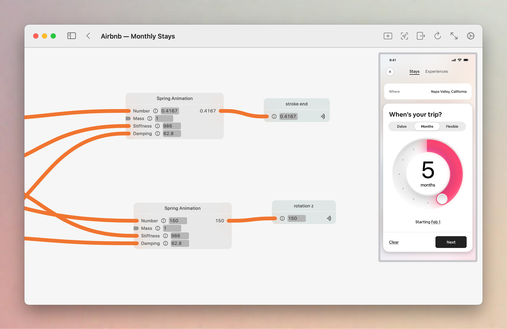

# Stitch 

 

We’re an open source, Apple first, and community driven prototyping environment.

Stitch works accross iPad, iPhone, macOS with Vision Pro coming soon. Apple Watch too if anyone wants. 😆

We're in beta and have so much more we want to give.

## What is Stitch
Stitch follows in the footsteps of giants, namely [QC](https://en.wikipedia.org/wiki/Quartz_Composer) and [Origami](http://origami.design).

We created Stitch to solve three main problems:

1. **Make it Open Source:** Freely available for everyone to modify and extend.
2. **Modern Apple Frameworks:** Base it on the latest from Apple. ARKit, CoreML, iCloud Syncing, SwiftUI, and support on every device they create.
3. **Touch First:** We're weirdly in love with the iPad, but it needs more powerful software. We're trying to help fix that.

## Apple Only
Part of the benifit of being all in on the Apple ecosystem is that we get several pretty amazing capabilities out of the box that others don't have.

1. **ARKit Support**. Use 3D models and place them in the real world easily. There's much more we can do here, but we've commited a proof of concept.
2. **CoreML Models**. Use any CoreML model, even those that you've trained yourself. We've also given you a few models to use that should help get you started.
3. **iCloud Syncing**. All your documents in one place, accross all devices. In the future this should also buy us live updating of projects as your change them accross devices. Also collaboration support, much like you're used to in apps like Freefrom, built on exactly the same APIs.

## Community

We're just starting our [Discord](https://discord.gg/eRk7D8jsD7) to discuss progress and share prototypes. Join us, help us improve with ideas and code. 

## Who We Are

We’re a group of passionate engineers and designers who share a love for Apple and prototyping. We’re mainly living in SF, but have contributors from all over.

#### Collaborators
##### Engineering:
* [Chris](https://github.com/pianostringquartet)
* [Elliot](https://github.com/ellbosch)
* [Nick](https://x.com/nickarner)
* [Ryan](https://www.ryapapap.com)

##### Design:
* [Adam](https://adammenges.com)
* [Josh](https://x.com/joshuapekera)

Want to help? Either open up a PR, Issue, or Email us (helloZZZZ@stitchdesign.app (remove the capital Z's)). We're looking for both engineering and design help.

Join in and help us, we’ll be keeping this list up to date.

### Getting Started with Local Development

> **After cloning, please use the `main` branch for our most stable code. Use `development` at your own risk!**

After you've cloned the repository, you'll need to make sure to update the project with your Development Team, and edit the Bundle ID to be something unique. Make sure to do this for both the `Stitch` and `StitchQuickLookExtension` targets; ensuring that the extension bundle prefix matches the main bundle ID.

Make sure that your development team has entitlements for CloudKit and Push Notifications. Then, create a new CloudKit container from Xcode; this [guide](https://developer.apple.com/documentation/cloudkit/enabling_cloudkit_in_your_app#3403299) from Apple shows you how. 

Once you've done that, you should be good to go for running and developing locally!

## Prototype Gallery

