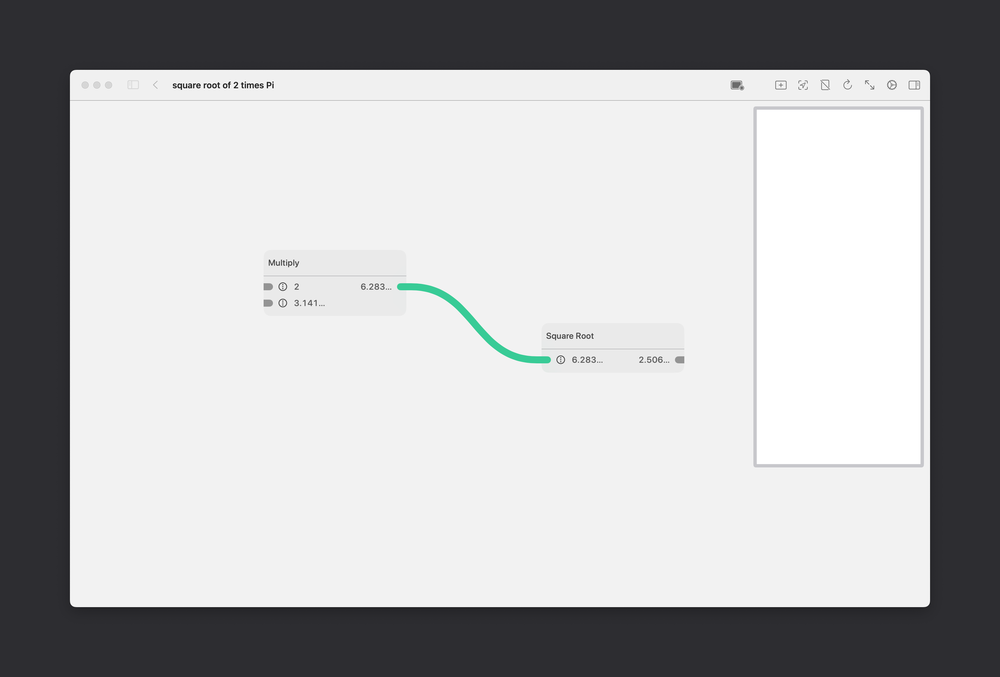
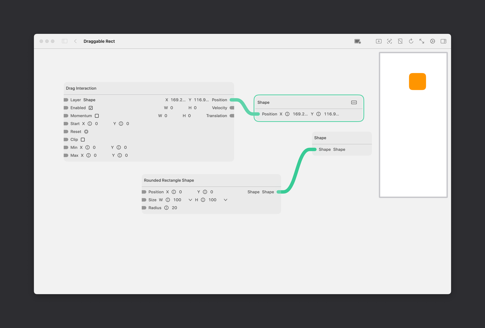
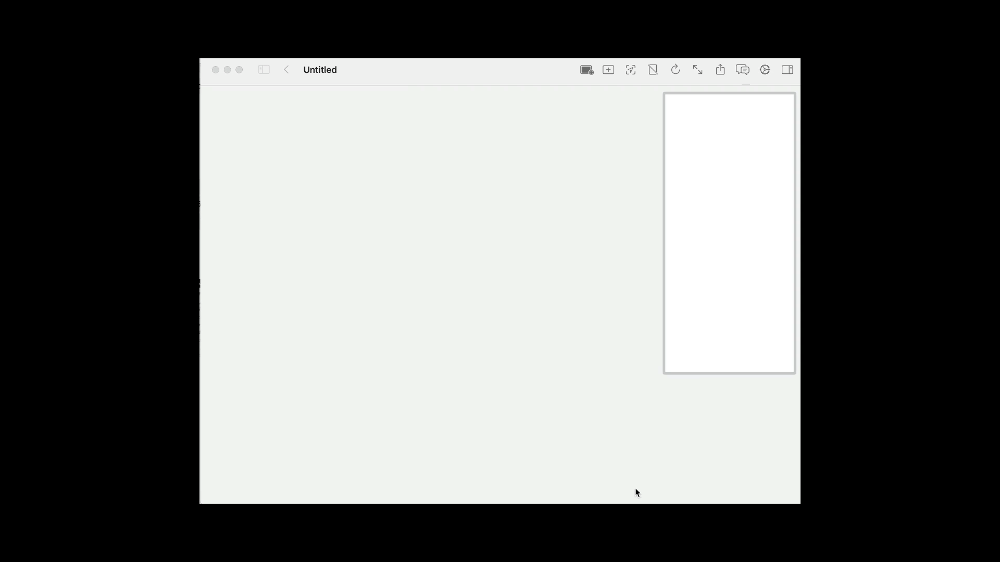
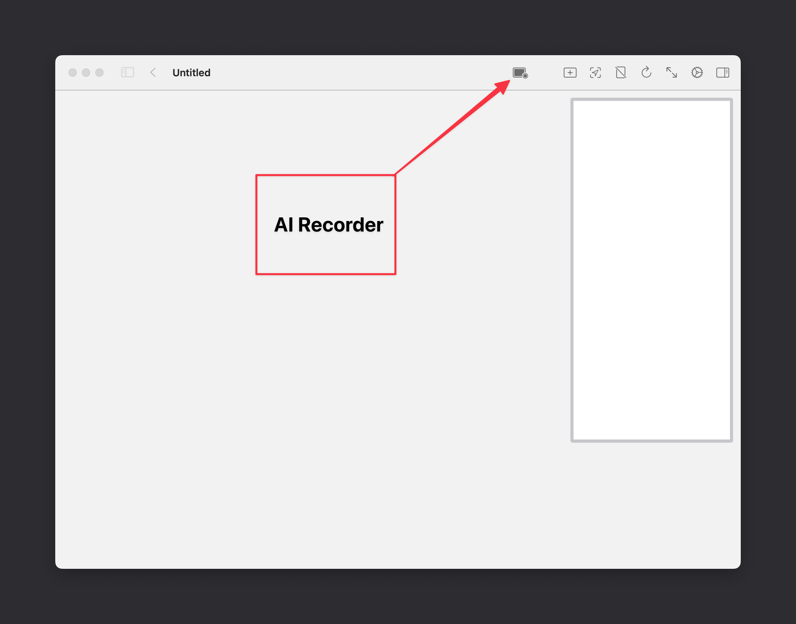
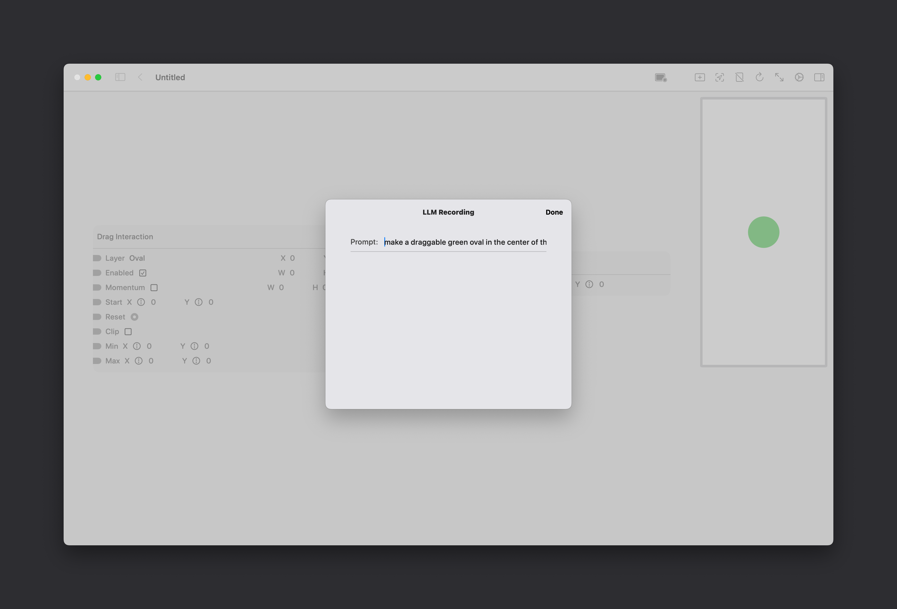
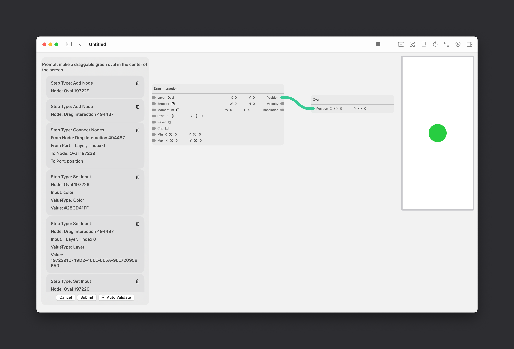

# StitchAI	

We’re working on an AI feature for Stitch. It’s a Copilot-like feature that generates simple graphs based on a user prompt. It's still in it’s early stages, and currently supports building a limited number of things that can be built in Stitch as-is.

The model is good at generating graphs that are roughly 5-6 nodes in size. It’s really good at things involving math (“find the square root of 2 times pi”):

And making interactive shapes:  (“make an orange rounded rect with a radius of 20 that I can drag around”)

We’re currently in the process of teaching it how to handle animations like this: 

We don’t yet support anything involving groups, but we’re working on that next. 

You can help improve the model by contributing your own examples, or issuing corrections if the model gives something wrong. Again, we don’t yet support groups, so don’t make any examples involving those just yet — we’ll update this doc when that’s ready.

## Generating Examples

The model is an OpenAI 4o model fine-tuned on prompt <> action pairs. We need more trining data though! And that’s where you come in - we’d love your help in creating training examples for our model. 

The way to do this is to open the app and create a new project. Click the AI Recorder button:

and then start creating your example just like you would with making any other graph. 

For now, focus on creating simple examples; not full, complete prototypes. Somewhere on the order of 5 - 10 total nodes for the graph

When you’re done creating the graph, enter the prompt:

Make sure your prompts are descriptive, and fully articulate everything that is happening in the graph. 

### Review and Submission

Once you’re done that, you can review the graph again to make sure it’s correct:

Once you’re satisifed with your example, hit Submit. 

The JSON that makes up the graph and the prompt you entered gets uploaded to our Supabase table. Once we have a certain number of new examples, we’ll train a new fine-tuned model on that data; and then release a new TestFlight with it. 

This is incredibly helpful work for helping us to further imporve our fine-tuned model.
